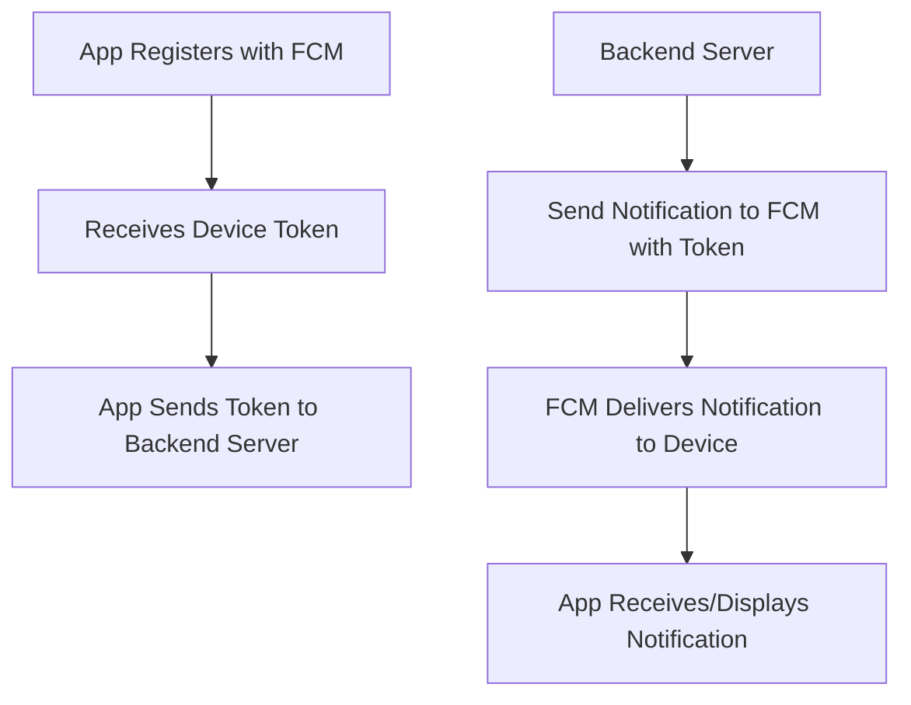

# Android Push Notification Flow Using FCM

Firebase Cloud Messaging (FCM) is the standard way to send push notifications to Android devices. Below is the typical flow for sending and receiving notifications using FCM.

## Main Steps

1. **App Registration**
   - The Android app registers with FCM and receives a unique device token.
   - The app sends this token to your backend server.

2. **Sending a Notification**
   - Your backend server sends a notification message to FCM, including the device token.
   - FCM authenticates and routes the message to the correct device.

3. **Receiving a Notification**
   - FCM delivers the notification to the device.
   - If the app is in the foreground, the message is delivered to the app's `FirebaseMessagingService`.
   - If the app is in the background, the system displays the notification automatically.

## Flow Diagram



## Example Code Snippet

```kotlin
// ...existing code...
class MyFirebaseMessagingService : FirebaseMessagingService() {
    override fun onMessageReceived(remoteMessage: RemoteMessage) {
        // Handle the received message
        // ...existing code...
    }
}
// ...existing code...
```

## Summary

- The app registers with FCM and gets a device token.
- The backend server sends notifications to FCM using the token.
- FCM delivers the notification to the device, and the app handles or displays it as needed.