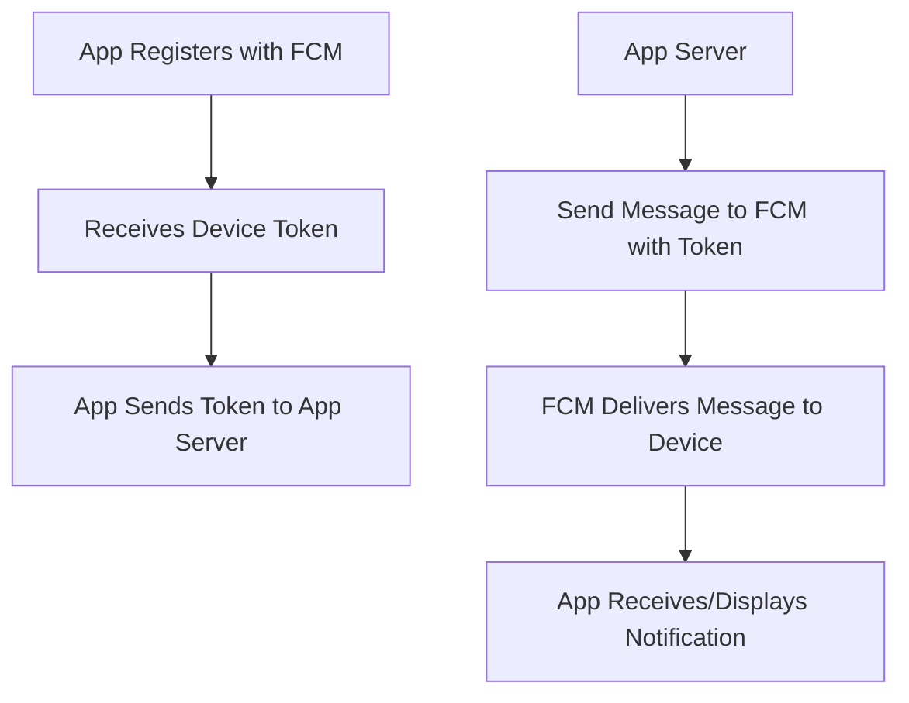

# How Does the Android Push Notification System Work?

Android push notifications allow apps to receive messages and alerts from a remote server, even when the app is not running.

## Key Components

- **App Server**: Your backend that decides when and what to notify users.
- **Firebase Cloud Messaging (FCM)**: Google's service for delivering push notifications to Android devices.
- **Device/Client App**: The Android app that receives and displays notifications.

## How It Works

1. **Registration**
   - The app registers with FCM and receives a unique device token.
   - The app sends this token to your app server.

2. **Sending a Notification**
   - Your app server sends a message (with the device token) to FCM.
   - FCM authenticates the request and routes the message to the correct device.

3. **Receiving a Notification**
   - FCM delivers the notification to the device.
   - The app receives the message in a `FirebaseMessagingService` (for data messages) or the system displays it directly (for notification messages).

## Notification Types

- **Notification Messages**: Handled by the system UI when the app is in the background.
- **Data Messages**: Delivered to the app for custom handling, even in the background (if configured).

## Example Flow



## Code Snippet: Receiving Notifications

```kotlin
class MyFirebaseMessagingService : FirebaseMessagingService() {
    override fun onMessageReceived(remoteMessage: RemoteMessage) {
        // Handle the received message
        // ...existing code...
    }
}
```

## Summary

- The app registers with FCM and gets a device token.
- The app server sends notifications to FCM, which delivers them to the device.
- The app handles or displays notifications as needed.